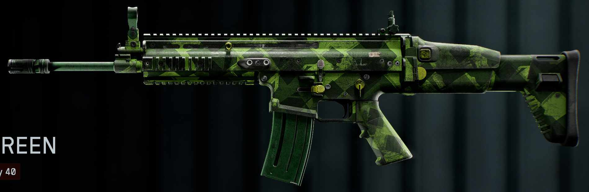
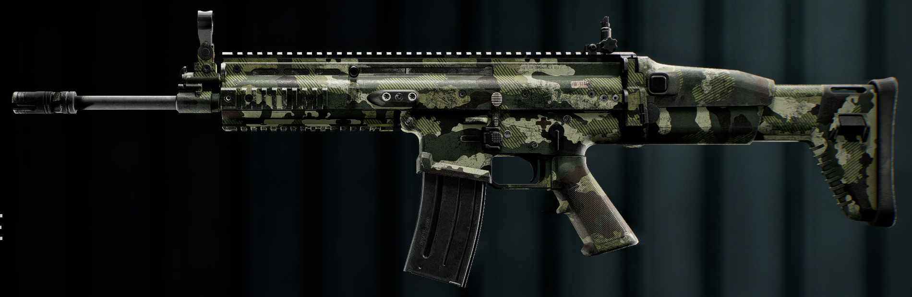
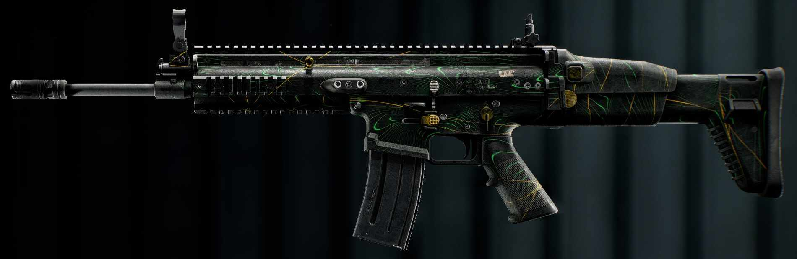
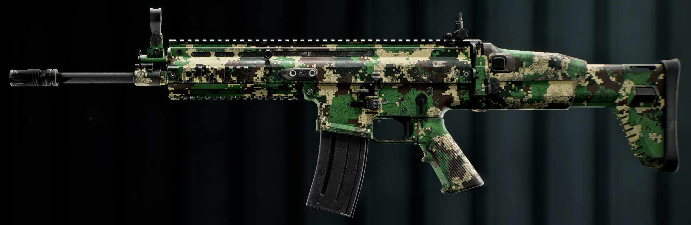
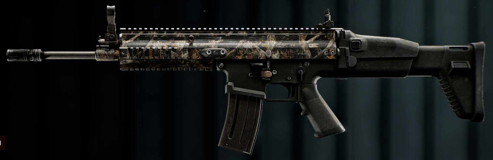
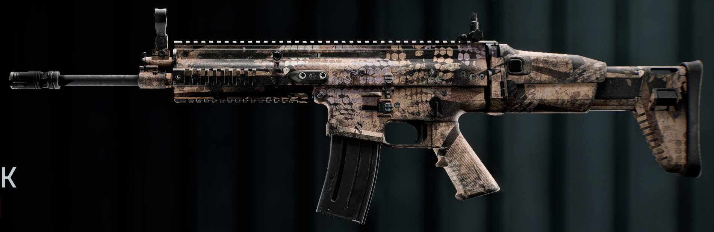
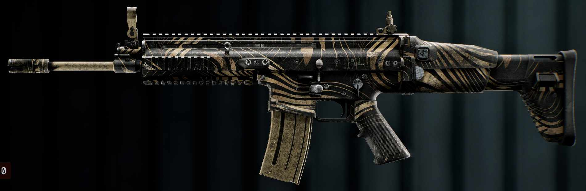
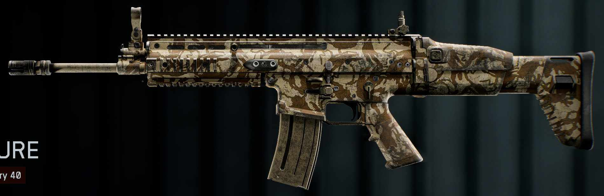
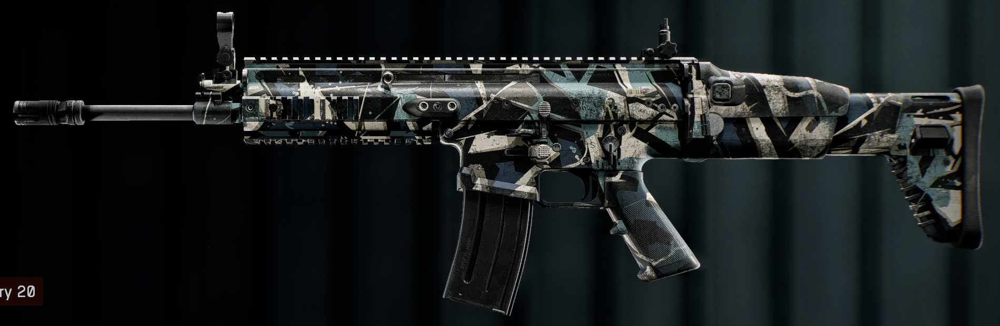

# bf6-camo-list

A complete database of all Battlefield 6 weapons and their camos currently in the game, organized into folders by the weapon class.  
Feel free to report any mistakes or problems.

### Search in this table to quickly move around

| Preview | Camo | Weapon | Class |
|:-------:|:----:|:------:|:-----:|
|  | [Abscission](LMG/M123K/Abscission.jpg) | [M123K](LMG/M123K) | [LMG](LMG) |
|  | [Aerial Green](SHOTGUN/M1014/Aerial_Green.jpg) | [M1014](SHOTGUN/M1014) | [SHOTGUN](SHOTGUN) |
|  | [Analog](ASSAULT_RIFLE/L85A3/Analog.jpg) | [L85A3](ASSAULT_RIFLE/L85A3) | [ASSAULT_RIFLE](ASSAULT_RIFLE) |
|  | [Aurora](SMG/UMG-40/Aurora.jpg) | [UMG-40](SMG/UMG-40) | [SMG](SMG) |
|  | [Avalanche](SMG/PW5A3/Avalanche.jpg) | [PW5A3](SMG/PW5A3) | [SMG](SMG) |
|  | [Backwater](SMG/PW7A2/Backwater.jpg) | [PW7A2](SMG/PW7A2) | [SMG](SMG) |
|  | [Biomass](SNIPER_RIFLE/M2010_ESR/Biomass.jpg) | [M2010 ESR](SNIPER_RIFLE/M2010_ESR) | [SNIPER_RIFLE](SNIPER_RIFLE) |
|  | [Black Swamp](SNIPER_RIFLE/M2010_ESR/Black_Swamp.jpg) | [M2010 ESR](SNIPER_RIFLE/M2010_ESR) | [SNIPER_RIFLE](SNIPER_RIFLE) |
|  | [Block Grove](CARBINE/M277/Block_Grove.jpg) | [M277](CARBINE/M277) | [CARBINE](CARBINE) |
|  | [Blowout](ASSAULT_RIFLE/B36A4/Blowout.jpg) | [B36A4](ASSAULT_RIFLE/B36A4) | [ASSAULT_RIFLE](ASSAULT_RIFLE) |
|  | [Boreal](ASSAULT_RIFLE/AK4D/Boreal.jpg) | [AK4D](ASSAULT_RIFLE/AK4D) | [ASSAULT_RIFLE](ASSAULT_RIFLE) |
|  | [Botanical](ASSAULT_RIFLE/NVO-228E/Botanical.jpg) | [NVO-228E](ASSAULT_RIFLE/NVO-228E) | [ASSAULT_RIFLE](ASSAULT_RIFLE) |
|  | [Bracken](DMR/SVK-8.6/Bracken.jpg) | [SVK-8.6](DMR/SVK-8.6) | [DMR](DMR) |
|  | [Branch](LMG/M250/Branch.jpg) | [M250](LMG/M250) | [LMG](LMG) |
|  | [Brushwood](SECONDARY/M45A1/Brushwood.jpg) | [M45A1](SECONDARY/M45A1) | [SECONDARY](SECONDARY) |
|  | [Cambium](SNIPER_RIFLE/PSR/Cambium.jpg) | [PSR](SNIPER_RIFLE/PSR) | [SNIPER_RIFLE](SNIPER_RIFLE) |
|  | [Canopy](CARBINE/GRT-BC/Canopy.jpg) | [GRT-BC](CARBINE/GRT-BC) | [CARBINE](CARBINE) |
|  | [Chaparral](ASSAULT_RIFLE/NVO-228E/Chaparral.jpg) | [NVO-228E](ASSAULT_RIFLE/NVO-228E) | [ASSAULT_RIFLE](ASSAULT_RIFLE) |
|  | [Chromatic](ASSAULT_RIFLE/TR-7/Chromatic.jpg) | [TR-7](ASSAULT_RIFLE/TR-7) | [ASSAULT_RIFLE](ASSAULT_RIFLE) |
|  | [Coppice](ASSAULT_RIFLE/M433/Coppice.jpg) | [M433](ASSAULT_RIFLE/M433) | [ASSAULT_RIFLE](ASSAULT_RIFLE) |
|  | [Copse](OTHER/Copse.jpg) | Unavailable | [OTHER](OTHER) |
|  | [Earthwork](OTHER/Earthwork.jpg) | Unavailable | [OTHER](OTHER) |
|  | [Encoded](ASSAULT_RIFLE/B36A4/Encoded.jpg) | [B36A4](ASSAULT_RIFLE/B36A4) | [ASSAULT_RIFLE](ASSAULT_RIFLE) |
|  | [Evergreen](CARBINE/SG_553R/Evergreen.jpg) | [SG 553R](CARBINE/SG_553R) | [CARBINE](CARBINE) |
|  | [Fallen Bark](ASSAULT_RIFLE/SOR-556_MK2/Fallen_Bark.jpg) | [SOR-556 MK2](ASSAULT_RIFLE/SOR-556_MK2) | [ASSAULT_RIFLE](ASSAULT_RIFLE) |
|  | [Forest Glitch](LMG/DRS-IAR/Forest_Glitch.jpg) | [DRS-IAR](LMG/DRS-IAR) | [LMG](LMG) |
|  | [Forest Mire](SMG/PW5A3/Forest_Mire.jpg) | [PW5A3](SMG/PW5A3) | [SMG](SMG) |
|  | [Gator](SMG/SCW-10/Gator.jpg) | [SCW-10](SMG/SCW-10) | [SMG](SMG) |
|  | [Green Gust](CARBINE/GRT-BC/Green_Gust.jpg) | [GRT-BC](CARBINE/GRT-BC) | [CARBINE](CARBINE) |
|  | [Harlequin Green](ASSAULT_RIFLE/KORD_6P67/Harlequin_Green.jpg) | [KORD 6P67](ASSAULT_RIFLE/KORD_6P67) | [ASSAULT_RIFLE](ASSAULT_RIFLE) |
|  | [Headwall](SMG/UMG-40/Headwall.jpg) | [UMG-40](SMG/UMG-40) | [SMG](SMG) |
|  | [Imperata](LMG/L110/Imperata.jpg) | [L110](LMG/L110) | [LMG](LMG) |
|  | [Jungle Raze](OTHER/Jungle_Raze.jpg) | Unavailable | [OTHER](OTHER) |
|  | [Leaf Fall](SMG/SCW-10/Leaf_Fall.jpg) | [SCW-10](SMG/SCW-10) | [SMG](SMG) |
|  | [Leatherback](ASSAULT_RIFLE/M433/Leatherback.jpg) | [M433](ASSAULT_RIFLE/M433) | [ASSAULT_RIFLE](ASSAULT_RIFLE) |
|  | [Lichen](SHOTGUN/18.5KS-K/Lichen.jpg) | [18.5KS-K](SHOTGUN/18.5KS-K) | [SHOTGUN](SHOTGUN) |
|  | [Mangrove](LMG/KTS100_MK8/Mangrove.jpg) | [KTS100 MK8](LMG/KTS100_MK8) | [LMG](LMG) |
|  | [Marsh](CARBINE/AK-205/Marsh.jpg) | [AK-205](CARBINE/AK-205) | [CARBINE](CARBINE) |
|  | [Nightbark](DMR/M39_EMR/Nightbark.jpg) | [M39 EMR](DMR/M39_EMR) | [DMR](DMR) |
|  | [Nucleated](LMG/M250/Nucleated.jpg) | [M250](LMG/M250) | [LMG](LMG) |
|  | [Overgrowth](CARBINE/SG_553R/Overgrowth.jpg) | [SG 553R](CARBINE/SG_553R) | [CARBINE](CARBINE) |
|  | [Ripple](SHOTGUN/M1014/Ripple.jpg) | [M1014](SHOTGUN/M1014) | [SHOTGUN](SHOTGUN) |
|  | [Royal Fern](CARBINE/AK-205/Royal_Fern.jpg) | [AK-205](CARBINE/AK-205) | [CARBINE](CARBINE) |
|  | [Sandstorm](SECONDARY/ES_5.7/Sandstorm.jpg) | [ES 5.7](SECONDARY/ES_5.7) | [SECONDARY](SECONDARY) |
|  | [Savanna](LMG/M60/Savanna.jpg) | [M/60](LMG/M60) | [LMG](LMG) |
|  | [Scarified](CARBINE/SG_553R/Scarified.jpg) | [SG 553R](CARBINE/SG_553R) | [CARBINE](CARBINE) |
|  | [Shear Zone](ASSAULT_RIFLE/NVO-228E/Shear_Zone.jpg) | [NVO-228E](ASSAULT_RIFLE/NVO-228E) | [ASSAULT_RIFLE](ASSAULT_RIFLE) |
|  | [Sherwood](CARBINE/M4A1/Sherwood.jpg) | [M4A1](CARBINE/M4A1) | [CARBINE](CARBINE) |
|  | [Smudge Land](DMR/M39_EMR/Smudge_Land.jpg) | [M39 EMR](DMR/M39_EMR) | [DMR](DMR) |
|  | [Splatter](LMG/L110/Splatter.jpg) | [L110](LMG/L110) | [LMG](LMG) |
|  | [Spring](SMG/KV9/Spring.jpg) | [KV9](SMG/KV9) | [SMG](SMG) |
|  | [Static Bloom](ASSAULT_RIFLE/SOR-556_MK2/Static_Bloom.jpg) | [SOR-556 MK2](ASSAULT_RIFLE/SOR-556_MK2) | [ASSAULT_RIFLE](ASSAULT_RIFLE) |
|  | [Swampland](SHOTGUN/M87A1/Swampland.jpg) | [M87A1](SHOTGUN/M87A1) | [SHOTGUN](SHOTGUN) |
|  | [Sylvan](LMG/L110/Sylvan.jpg) | [L110](LMG/L110) | [LMG](LMG) |
|  | [Tangled Vine](SMG/SCW-10/Tangled_Vine.jpg) | [SCW-10](SMG/SCW-10) | [SMG](SMG) |
|  | [Tendril](SMG/SL9/Tendril.jpg) | [SL9](SMG/SL9) | [SMG](SMG) |
|  | [Tidal Marsh](DMR/LMR27/Tidal_Marsh.jpg) | [LMR27](DMR/LMR27) | [DMR](DMR) |
|  | [Torch Moss](LMG/M240L/Torch_Moss.jpg) | [M240 L](LMG/M240L) | [LMG](LMG) |
|  | [Treehopper](SHOTGUN/M1014/Treehopper.jpg) | [M1014](SHOTGUN/M1014) | [SHOTGUN](SHOTGUN) |
|  | [Verdant Dash](SMG/KV9/Verdant_Dash.jpg) | [KV9](SMG/KV9) | [SMG](SMG) |
|  | [Verglas](ASSAULT_RIFLE/KORD_6P67/Verglas.jpg) | [KORD 6P67](ASSAULT_RIFLE/KORD_6P67) | [ASSAULT_RIFLE](ASSAULT_RIFLE) |
|  | [Wetland](ASSAULT_RIFLE/B36A4/Wetland.jpg) | [B36A4](ASSAULT_RIFLE/B36A4) | [ASSAULT_RIFLE](ASSAULT_RIFLE) |
|  | [Wild Felidae](CARBINE/M417_A2/Wild_Felidae.jpg) | [M417 A2](CARBINE/M417_A2) | [CARBINE](CARBINE) |
|  | [Woodland](OTHER/Woodland.jpg) | Unavailable | [OTHER](OTHER) |
|  | [Arboreal](LMG/DRS-IAR/Arboreal.jpg) | [DRS-IAR](LMG/DRS-IAR) | [LMG](LMG) |
|  | [Barren](LMG/DRS-IAR/Barren.jpg) | [DRS-IAR](LMG/DRS-IAR) | [LMG](LMG) |
|  | [Saguaro](SMG/PW5A3/Saguaro.jpg) | [PW5A3](SMG/PW5A3) | [SMG](SMG) |
|  | [Blistered](CARBINE/QBZ-192/Blistered.jpg) | [QBZ-192](CARBINE/QBZ-192) | [CARBINE](CARBINE) |
|  | [Broadleaf](CARBINE/GRT-BC/Broadleaf.jpg) | [GRT-BC](CARBINE/GRT-BC) | [CARBINE](CARBINE) |
|  | [Carapace](SECONDARY/P18/Carapace.jpg) | [P18](SECONDARY/P18) | [SECONDARY](SECONDARY) |
|  | [Cascade](SMG/SGX/Cascade.jpg) | [SGX](SMG/SGX) | [SMG](SMG) |
|  | [Circuit](ASSAULT_RIFLE/TR-7/Circuit.jpg) | [TR-7](ASSAULT_RIFLE/TR-7) | [ASSAULT_RIFLE](ASSAULT_RIFLE) |
|  | [Diamondback](SECONDARY/M45A1/Diamondback.jpg) | [M45A1](SECONDARY/M45A1) | [SECONDARY](SECONDARY) |
|  | [Dunes](CARBINE/QBZ-192/Dunes.jpg) | [QBZ-192](CARBINE/QBZ-192) | [CARBINE](CARBINE) |
|  | [Everglade](DMR/SVDM/Everglade.jpg) | [SVDM](DMR/SVDM) | [DMR](DMR) |
|  | [Forest Shutter](SNIPER_RIFLE/SV-98/Forest_Shutter.jpg) | [SV-98](SNIPER_RIFLE/SV-98) | [SNIPER_RIFLE](SNIPER_RIFLE) |
|  | [Hard Cover](SECONDARY/M44/Hard_Cover.jpg) | [M44](SECONDARY/M44) | [SECONDARY](SECONDARY) |
|  | [Hawthorn](SNIPER_RIFLE/PSR/Hawthorn.jpg) | [PSR](SNIPER_RIFLE/PSR) | [SNIPER_RIFLE](SNIPER_RIFLE) |
|  | [Heat Signature](LMG/KTS100_MK8/Heat_Signature.jpg) | [KTS100](LMG/KTS100_MK8) | [LMG](LMG) |
|  | [Hinterland](DMR/SVDM/Hinterland.jpg) | [SVDM](DMR/SVDM) | [DMR](DMR) |
|  | [Hive](SMG/PW7A2/Hive.jpg) | [PW7A2](SMG/PW7A2) | [SMG](SMG) |
|  | [Jagged](SMG/USG-90/Jagged.jpg) | [USG-90](SMG/USG-90) | [SMG](SMG) |
|  | [Leopard Spot](ASSAULT_RIFLE/M433/Leopard_Spot.jpg) | [M433](ASSAULT_RIFLE/M433) | [ASSAULT_RIFLE](ASSAULT_RIFLE) |
|  | [Mud](LMG/RPKM/Mud.jpg) | [RPKM](LMG/RPKM) | [LMG](LMG) |
|  | [Oasis Grid](LMG/M123K/Oasis_Grid.jpg) | [M123K](LMG/M123K) | [LMG](LMG) |
|  | [Outcrop](LMG/M60/Outcrop.jpg) | [M/60](LMG/M60) | [LMG](LMG) |
|  | [Sagebrush](SHOTGUN/M87A1/Sagebrush.jpg) | [M87A1](SHOTGUN/M87A1) | [SHOTGUN](SHOTGUN) |
| [Sandbyte](SCDM/Sandbyte.jpg) | [SCDM](SCDM) |  |
|  | [Sandlock](SMG/SGX/Sandlock.jpg) | [SGX](SMG/SGX) | [SMG](SMG) |
|  | [Stratum](CARBINE/M4A1/Stratum.jpg) | [M4A1](CARBINE/M4A1) | [CARBINE](CARBINE) |
|  | [Sunworn](DMR/LMR27/Sunworn.jpg) | [LMR27](DMR/LMR27) | [DMR](DMR) |
|  | [Terra Firma](CARBINE/M277/Terra_Firma.jpg) | [M277](CARBINE/M277) | [CARBINE](CARBINE) |
|  | [Tigris](SECONDARY/M45A1/Tigris.jpg) | [M45A1](SECONDARY/M45A1) | [SECONDARY](SECONDARY) |
|  | [Trigon](LMG/M123K/Trigon.jpg) | [M123K](LMG/M123K) | [LMG](LMG) |
|  | [Vapor](SNIPER_RIFLE/M2010_ESR/Vapor.jpg) | [M2010](SNIPER_RIFLE/M2010_ESR) | [SNIPER_RIFLE](SNIPER_RIFLE) |
|  | [Whiptail](SNIPER_RIFLE/SV-98/Whiptail.jpg) | [SV-98](SNIPER_RIFLE/SV-98) | [SNIPER_RIFLE](SNIPER_RIFLE) |
|  | [Whitenoise](LMG/M240L/Whitenoise.jpg) | [M240L](LMG/M240L) | [LMG](LMG) |
|  | [Wildwood](CARBINE/M277/Wildwood.jpg) | [M277](CARBINE/M277) | [CARBINE](CARBINE) |
|  | [Windswept](SMG/SGX/Windswept.jpg) | [SGX](SMG/SGX) | [SMG](SMG) |
|  | [Wire](DMR/SVK-8.6/Wire.jpg) | [SVK-8.6](DMR/SVK-8.6) | [DMR](DMR) |
|  | [Cold Fame](SMG/USG-90/Cold_Fame.jpg) | [USG-90](SMG/USG-90) | [SMG](SMG) |
|  | [Cold Front](SMG/SL9/Cold_Front.jpg) | [SL9](SMG/SL9) | [SMG](SMG) |
|  | [Cryojacket](LMG/RPKM/Cryojacket.jpg) | [RPKM](LMG/RPKM) | [LMG](LMG) |
|  | [Dolomite](CARBINE/M417_A2/Dolomite.jpg) | [M417](CARBINE/M417_A2) | [CARBINE](CARBINE) |
|  | [Permafrost](CARBINE/QBZ-192/Permafrost.jpg) | [QBZ-192](CARBINE/QBZ-192) | [CARBINE](CARBINE) |
|  | [Polar Nexus](OTHER/Polar_Nexus.jpg) | Assignment CHALLENGE EXPERT 1 | [OTHER](OTHER) |
|  | [Snowpeaks](DMR/SVK-8.6/Snowpeaks.jpg) | [SVK-8.6](DMR/SVK-8.6) | [DMR](DMR) |
|  | [Snowtracks](ASSAULT_RIFLE/KORD_6P67/Snowtracks.jpg) | [KORD 6P67](ASSAULT_RIFLE/KORD_6P67) | [ASSAULT_RIFLE](ASSAULT_RIFLE) |
|  | [Urban](LMG/KTS100_MK8/Urban.jpg) | [KTS100 MK8](LMG/KTS100_MK8) | [LMG](LMG) |
|  | [Winter Forecast](SECONDARY/M44/Winter_Forecast.jpg) | [M44](SECONDARY/M44) | [SECONDARY](SECONDARY) |
|  | [Wintergreen](SECONDARY/P18/Wintergreen.jpg) | [P18](SECONDARY/P18) | [SECONDARY](SECONDARY) |
|  | [Wintershade](SECONDARY/ES_5.7/Wintershade.jpg) | [ES 5.7](SECONDARY/ES_5.7) | [SECONDARY](SECONDARY) |
|  | [Birch](DMR/LMR27/Birch.jpg) | [LMR27](DMR/LMR27) | [DMR](DMR) |
|  | [Cobalt](SHOTGUN/M87A1/Cobalt.jpg) | [M87A1](SHOTGUN/M87A1) | [SHOTGUN](SHOTGUN) |
|  | [Shard](ASSAULT_RIFLE/SOR-556_MK2/Shard.jpg) | [SOR-556 MK2](ASSAULT_RIFLE/SOR-556_MK2) | [ASSAULT_RIFLE](ASSAULT_RIFLE) |
|  | [Basalt](SMG/PW7A2/Basalt.jpg) | [PW7A2](SMG/PW7A2) | [SMG](SMG) |
|  | [City Mesh](LMG/M240L/City_Mesh.jpg) | [M240L](LMG/M240L) | [LMG](LMG) |
|  | [Cloudstorm](ASSAULT_RIFLE/L85A3/Cloudstorm.jpg) | [L85A3](ASSAULT_RIFLE/L85A3) | [ASSAULT_RIFLE](ASSAULT_RIFLE) |
|  | [Glitch](CARBINE/M417_A2/Glitch.jpg) | [M417 A2](CARBINE/M417_A2) | [CARBINE](CARBINE) |
|  | [Grayscale](SHOTGUN/18.5KS-K/Grayscale.jpg) | [18.5KS-K](SHOTGUN/18.5KS-K) | [SHOTGUN](SHOTGUN) |
|  | [Grey Marsh](SNIPER_RIFLE/SV-98/Grey_Marsh.jpg) | [SV-98](SNIPER_RIFLE/SV-98) | [SNIPER_RIFLE](SNIPER_RIFLE) |
|  | [Iron Point](SECONDARY/ES_5.7/Iron_Point.jpg) | [ES 5.7](SECONDARY/ES_5.7) | [SECONDARY](SECONDARY) |
|  | [Snowcap](SECONDARY/P18/Snowcap.jpg) | [P18](SECONDARY/P18) | [SECONDARY](SECONDARY) |
|  | [Twilight](CARBINE/M4A1/Twilight.jpg) | [M4A1](CARBINE/M4A1) | [CARBINE](CARBINE) |
|  | [Apparition](SHOTGUN/18.5KS-K/Apparition.jpg) | [18.5KS-K](SHOTGUN/18.5KS-K) | [SHOTGUN](SHOTGUN) |
|  | [Arctic Static](LMG/M60/Arctic_Static.jpg) | [M/60](LMG/M60) | [LMG](LMG) |
|  | [Bitstorm](SNIPER_RIFLE/PSR/Bitstorm.jpg) | [PSR](SNIPER_RIFLE/PSR) | [SNIPER_RIFLE](SNIPER_RIFLE) |
|  | [Cloudburst](ASSAULT_RIFLE/TR-7/Cloudburst.jpg) | [TR-7](ASSAULT_RIFLE/TR-7) | [ASSAULT_RIFLE](ASSAULT_RIFLE) |
|  | [Fabric Glint](SMG/KV9/Fabric_Glint.jpg) | [KV9](SMG/KV9) | [SMG](SMG) |
|  | [Graphic](CARBINE/AK-205/Graphic.jpg) | [AK-205](CARBINE/AK-205) | [CARBINE](CARBINE) |
|  | [Molten](SMG/SL9/Molten.jpg) | [SL9](SMG/SL9) | [SMG](SMG) |
|  | [North Terrain](ASSAULT_RIFLE/L85A3/North_Terrain.jpg) | [L85A3](ASSAULT_RIFLE/L85A3) | [ASSAULT_RIFLE](ASSAULT_RIFLE) |
|  | [Pixel Pine](LMG/M250/Pixel_Pine.jpg) | [M250](LMG/M250) | [LMG](LMG) |
|  | [Roadway](DMR/M39_EMR/Roadway.jpg) | [M39 EMR](DMR/M39_EMR) | [DMR](DMR) |
|  | [Smokeline](SMG/USG-90/Smokeline.jpg) | [USG-90](SMG/USG-90) | [SMG](SMG) |
|  | [Stain](LMG/RPKM/Stain.jpg) | [RPKM](LMG/RPKM) | [LMG](LMG) |
|  | [Stripes](SMG/UMG-40/Stripes.jpg) | [UMG-40](SMG/UMG-40) | [SMG](SMG) |
|  | [Subdivide](ASSAULT_RIFLE/AK4D/Subdivide.jpg) | [AK4D](ASSAULT_RIFLE/AK4D) | [ASSAULT_RIFLE](ASSAULT_RIFLE) |
|  | [Torrent](ASSAULT_RIFLE/AK4D/Torrent.jpg) | [AK4D](ASSAULT_RIFLE/AK4D) | [ASSAULT_RIFLE](ASSAULT_RIFLE) |
|  | [Valley](SECONDARY/M44/Valley.jpg) | [M44](SECONDARY/M44) | [SECONDARY](SECONDARY) |